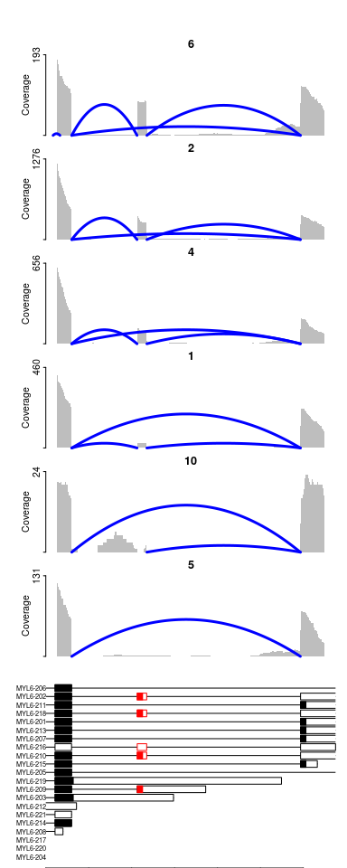

Single cell tutorial
================
2024-11-19

- [Download GBM data from 10x](#download-gbm-data-from-10x)
- [Download gene annotation (2020A)](#download-gene-annotation-2020a)
- [Plot per celltype coverage](#plot-per-celltype-coverage)
  - [load celltype annotation](#load-celltype-annotation)
  - [loag gene annotation](#loag-gene-annotation)
  - [load coverage](#load-coverage)
  - [plot](#plot)

``` r
#devtools::install_github("mamarkevi/plotCoverage")
library('plotCoverage')
```

# Download GBM data from 10x

``` bash
path="https://s3-us-west-2.amazonaws.com/10x.files/samples/cell-vdj/4.0.0/Parent_SC5v1_Human_Glioblastoma/Parent_SC5v1_Human_Glioblastoma"
wget -nv ${path}_possorted_genome_bam.bam -O alignment.bam
wget -nv ${path}_possorted_genome_bam.bam.bai -O alignment.bam.bai
wget -nv ${path}_analysis.tar.gz -O clusters.tar.gz
tar -xzf clusters.tar.gz
```

# Download gene annotation (2020A)

# Plot per celltype coverage

## load celltype annotation

``` r
celltypes = read.csv('analysis/clustering/graphclust/clusters.csv')
```

## loag gene annotation

``` r
# it can take a while (5-10min)
gtf = plotCoverage::loadEnsGTF('gene.gtf')
# set colors for exons
# mark exon of interest in red
gtf$exon.col = 'black'
gtf$cds.col = 'black'
f = gtf$start >= 56160500 & gtf$stop <= 56160700
gtf$exon.col[f]=gtf$cds.col[f] = 'red'
```

## load coverage

``` r
cts = sort(unique(celltypes$Cluster))
cov = lapply(cts,function(cl){
  getReadCoverage('alignment.bam',
                  chr = 'chr12',
                  start = 56160250,
                  end = 56161500,
                  scanBamFlags=list(isNotPassingQualityControls=FALSE,isDuplicate=FALSE,isSupplementaryAlignment=FALSE,isSecondaryAlignment=FALSE),
                  tagFilter = list('CB'=celltypes$Barcode[celltypes$Cluster==cl]) # cellect barcodes for given selltype
                  )
})
```

    ## Loading required package: GenomicAlignments

    ## Loading required package: BiocGenerics

    ## 
    ## Attaching package: 'BiocGenerics'

    ## The following objects are masked from 'package:stats':
    ## 
    ##     IQR, mad, sd, var, xtabs

    ## The following objects are masked from 'package:base':
    ## 
    ##     anyDuplicated, aperm, append, as.data.frame, basename, cbind,
    ##     colnames, dirname, do.call, duplicated, eval, evalq, Filter, Find,
    ##     get, grep, grepl, intersect, is.unsorted, lapply, Map, mapply,
    ##     match, mget, order, paste, pmax, pmax.int, pmin, pmin.int,
    ##     Position, rank, rbind, Reduce, rownames, sapply, setdiff, sort,
    ##     table, tapply, union, unique, unsplit, which.max, which.min

    ## Loading required package: S4Vectors

    ## Loading required package: stats4

    ## 
    ## Attaching package: 'S4Vectors'

    ## The following object is masked from 'package:utils':
    ## 
    ##     findMatches

    ## The following objects are masked from 'package:base':
    ## 
    ##     expand.grid, I, unname

    ## Loading required package: IRanges

    ## Loading required package: GenomeInfoDb

    ## Loading required package: GenomicRanges

    ## Loading required package: SummarizedExperiment

    ## Loading required package: MatrixGenerics

    ## Loading required package: matrixStats

    ## 
    ## Attaching package: 'MatrixGenerics'

    ## The following objects are masked from 'package:matrixStats':
    ## 
    ##     colAlls, colAnyNAs, colAnys, colAvgsPerRowSet, colCollapse,
    ##     colCounts, colCummaxs, colCummins, colCumprods, colCumsums,
    ##     colDiffs, colIQRDiffs, colIQRs, colLogSumExps, colMadDiffs,
    ##     colMads, colMaxs, colMeans2, colMedians, colMins, colOrderStats,
    ##     colProds, colQuantiles, colRanges, colRanks, colSdDiffs, colSds,
    ##     colSums2, colTabulates, colVarDiffs, colVars, colWeightedMads,
    ##     colWeightedMeans, colWeightedMedians, colWeightedSds,
    ##     colWeightedVars, rowAlls, rowAnyNAs, rowAnys, rowAvgsPerColSet,
    ##     rowCollapse, rowCounts, rowCummaxs, rowCummins, rowCumprods,
    ##     rowCumsums, rowDiffs, rowIQRDiffs, rowIQRs, rowLogSumExps,
    ##     rowMadDiffs, rowMads, rowMaxs, rowMeans2, rowMedians, rowMins,
    ##     rowOrderStats, rowProds, rowQuantiles, rowRanges, rowRanks,
    ##     rowSdDiffs, rowSds, rowSums2, rowTabulates, rowVarDiffs, rowVars,
    ##     rowWeightedMads, rowWeightedMeans, rowWeightedMedians,
    ##     rowWeightedSds, rowWeightedVars

    ## Loading required package: Biobase

    ## Welcome to Bioconductor
    ## 
    ##     Vignettes contain introductory material; view with
    ##     'browseVignettes()'. To cite Bioconductor, see
    ##     'citation("Biobase")', and for packages 'citation("pkgname")'.

    ## 
    ## Attaching package: 'Biobase'

    ## The following object is masked from 'package:MatrixGenerics':
    ## 
    ##     rowMedians

    ## The following objects are masked from 'package:matrixStats':
    ## 
    ##     anyMissing, rowMedians

    ## Loading required package: Biostrings

    ## Loading required package: XVector

    ## 
    ## Attaching package: 'Biostrings'

    ## The following object is masked from 'package:base':
    ## 
    ##     strsplit

    ## Loading required package: Rsamtools

    ##  1       1       1       1       1       1       1       1       1       1

``` r
names(cov) = cts
```

## plot

``` r
# select celltypse to show
# from high to low PSI 
cl_order = as.character(c(6,2,4,1,10,5))
layout(as.matrix(1:(length(cl_order)+1),ncol=1),heights = c(rep(1,length(cl_order)),2))
par(bty='n',tcl=-0.2,mgp=c(1.3,0.3,0),mar=c(0,4,1.5,0),oma=c(0,0,3,1))
for(cl in cl_order)
  plotReadCov(cov[[cl]],main=cl,xaxt='n',ylab='Coverage',min.junc.cov = 2,min.junc.cov.f = 0.02)
plotTranscripts(gtf,new = T,exon.col = NA,cds.col = NA,xlim=c(cov[[1]]$start,cov[[1]]$end))
```

<!-- -->
